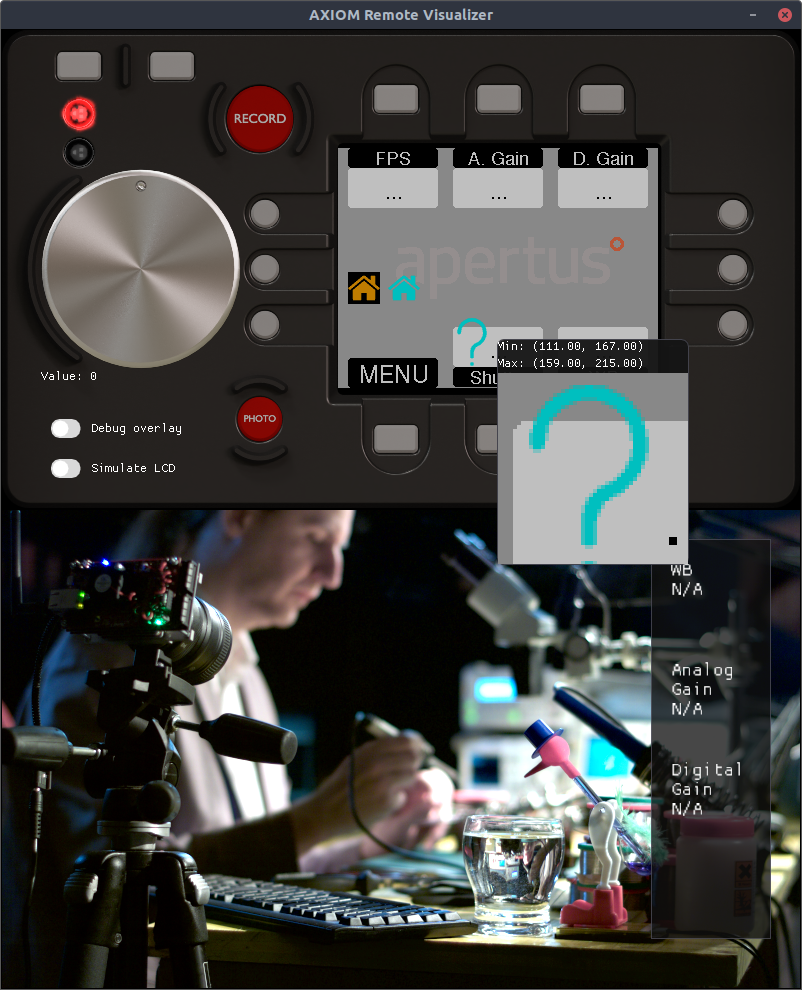

# Draw2BitIcon()

## Creating icons
Creating icons is currently done with a separate Python script,  
please see https://github.com/MarkusEngsner/png2Cheader

It works for PNGs and SVGs, using CairoSVG and Pillow.

## Draw2BitIcon()
`Draw2BitIcon()` currently supports picking a foreground color,  
as well as a background color.  
It then uses these colors to interpolate color values for pixels  
with the values `0x1` and `0x2`.  
The interpolation is currently done linearly,   
with the fixed values of 0.3 and 0.7 representing `0x1` and `0x2`, respectively.  

### Implementation

#### Helpers  

* `Lerp (Utils.h)`: Linear interpolation between two uint8_t values.  
* `LerpColor (Painter.cpp)`: Linear interpolation between two RGB565 colors.  
* `Painter::GetPixel (Painter.cpp)`: Helper to get the current color at a point   
    in the framebuffer. This currenly doesn't do any bounds checking.
* `GetColor (Painter.cpp)`: Maps a 2Bit representation of a Pixel to a color.

I wasn't sure if LerpColor should go in `Utils.h` too,  
    seeing as it is pretty generic. For now I put it in the `Painter.cpp` file.

#### The function itself

`Draw2BitIcon` iterates over the entire framebuffer, one row at a time.  
I choose to diverge slightly from the original implementation of `DrawIcon()`,  
which uses two loops for each row.  
This does result in defining `currentByte` with the same value  4 times for each byte,  
 but in return it reduces the complexity by only needing 1 loop per row.

### Testing
Tests have been implemented for the `Draw2BitIcon()` function.  
Seeing as these tests use the same Interpolation functions,  
additional tests should be added for the helpers as well.

## Screenshot

*Picture showing the home icon being rendering with and without transparency,
in addition to the help icon.*
